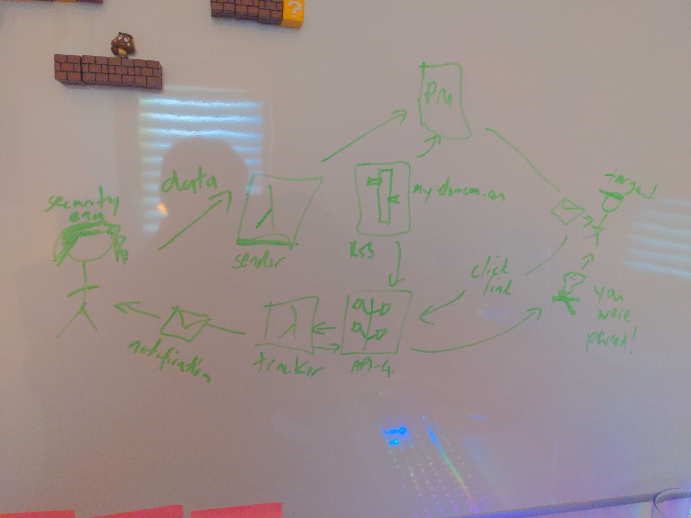

# Roy's Serverless Phishing Framework


This repo is designed to help you set up a quick phishing simulation to test
your organisation's response.

__BY READING PAST THIS POINT YOU MAGICALLY AGREE NOT TO USE ANYTHING YOU FIND
HERE FOR NEFARIOUS PURPOSES__

## Design

There are three main steps in carrying out the phishing simulation:

1. _Deliverability_: Ensure that you give yourself every chance of arriving in
   the inbox. You'll need to bring your own domain (in the form of a live
   Route53 zone), and we'll add all the goodies that make it look (to email
   providers) like it's not just a throwaway address.
2. _Execution_: We'll use Postmark (free tier available) to fire off the attack.
   A basic email template is provided but you'll probably have more success if
   you tailor this to your target.
3. _Reporting_: Whilst Postmark reports on opens, we want any victims to go
   directly to our target (since real phishing attacks almost certainly won't
   include target links that are routed via Postmark). We collect the clicks for
   you and let you (and the victim) know that they have been snagged.



## Instructions

_Please note that you may incur costs for these services and you should follow
the usual best practice guides to secure any accounts that you set up_

### Postmark Account Setup I

1. Create a [Postmark account](https://account.postmarkapp.com/sign_up)
2. [Add a domain](https://account.postmarkapp.com/signatures/add)
   - Note down the DKIM hostname and value for this domain
3. [Create a server](https://account.postmarkapp.com/servers/new)
   - Navigate to the server » API tokens and note down that token

### AWS Account Setup I (manual)

1. Register a domain (if you need inspiration, check out
   [URLCrazy](https://github.com/urbanadventurer/urlcrazy) for ideas)
2. Create an [AWS account](https://portal.aws.amazon.com/billing/signup#/start)
   and create a Route53 zone that manages your domain. Be sure to update the
   nameservers in your DNS registry so that this zone is live.
3. Go to [Parameter Store](https://ap-southeast-2.console.aws.amazon.com/systems-manager/parameters/create)
   and create a new parameter with the following details:
    - Name: `/roy-spf-sender/postmark-server-token`
    - Type: `SecureString`
    - KMS key: either stick with `alias/aws/ssm` or choose your own and feed
      that into terraform as a variable
    - Value: Your Postmark server API token from the Postmark setup section
4. Create a second parameter with the same details, but Name:
   `/roy-spf-tracker/postmark-server-token`

### AWS Account Setup II (terraform)

1. Install Terraform >= 1.5 and
   [set up your AWS credentials](https://registry.terraform.io/providers/hashicorp/aws/latest/docs)
2. Build the lambda functions (see [Building the lambdas](#building-the-lambdas))
   or download the zip files from the [latest release](https://github.com/sjauld/roy-spf/releases/latest)
   and put them in a sensible local directory.
3. Create a terraform file that calls the module in this repo (see
   [the example in this repo](./infra/example/main.tf)). This is where you'll
   add your Postmark DKIM hostname and value, the domain name you'll be using,
   and the path to the zip files.
4. `terraform init && terraform apply`

This will now build all the shiny resources you need.

### Postmark Account Setup II

1. Navigate back to your Postmark domain and click the verify button next to the
   DKIM and Return-Path records.
2. Now navigate to your server and build a nice template that you want to use as
   part of your phishing exercise. Make sure you add a link to `{{tracker_url}}`.
   Update the template alias and note it down.
   It's worth reading about Postmark's template language which you may want to
   use to personalise your attack.

### Attack (script version)!

The easiest way to launch an attack against multiple targets is with `attack.sh`.

First, create a targets CSV file. **Note: `.csv` files are excluded from git to
prevent real target lists from being accidentally committed** (except for
`targets.example.csv`). Use the provided example as a starting point:

```sh
cp targets.example.csv targets.csv
```

The format is `name,email` — one target per line, no header row:

```
Bob Smith,bob@example.com
Jane Doe,jane@example.com
```

Then launch the attack:

```sh
./attack.sh \
  --file targets.csv \
  --template roy-test \
  --from "Fake Address <fake@example-security.com>"
```

Options:

| Flag | Required | Description |
|---|---|---|
| `--file` | yes | Path to your targets CSV |
| `--template` | yes | Postmark template alias |
| `--from` | yes | Sender address shown to targets |
| `--function-name` | no | Lambda function name (default: `RoySPFSender`) |

### Attack (GUI version)!

1. Log in to AWS and navigate to the
   [sender lambda](https://ap-southeast-2.console.aws.amazon.com/lambda/home?region=ap-southeast-2#/functions/RoySPFSender?tab=code)
2. Go to the test tab
3. Paste in your payload
   ```json
   {
     "targets": [{
        "address": "My Target <address@example.com>",
        "template_model": {
           "name": "Target"
        }
     }],
     "postmark_template_alias": "roy-test",
     "from": "Fake Address <fake@example-security.com>"
   }
   ```
4. Click _Test_

### Attack (CLI version)!

Of course, real pros use the CLI.

```sh
aws lambda invoke \
  --function-name RoySPFSender \
  --cli-binary-format raw-in-base64-out \
  --payload '{
     "targets": [{
        "address": "My Target <address@example.com>",
        "template_model": {
           "name": "Target"
        }
     }],
     "postmark_template_alias": "roy-test",
     "from": "Fake Address <fake@example-security.com>"
  }' /dev/null
```

## Building the lambdas

If you need to make some changes to the lambdas, check out this repo, make
your changes and then run:

```sh
./build.sh
```

This produces `sender.zip` and `tracker.zip`, ready to be referenced in your
Terraform config.

## Releases

Tagged releases are built automatically via GitHub Actions. Each push to `main`
is tagged using conventional commits (defaulting to a patch bump), and
`sender.zip` and `tracker.zip` are attached as release assets.
